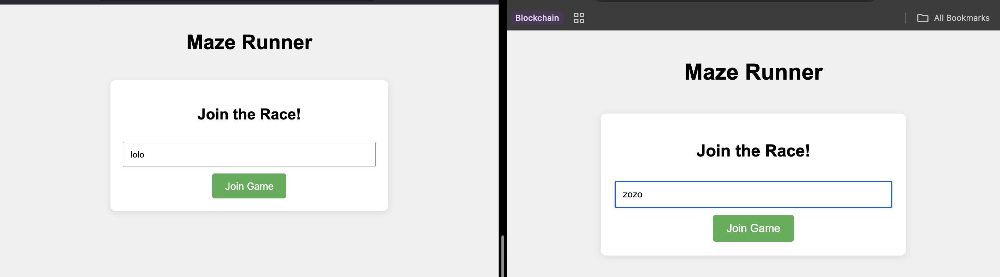

# MazeRunner

A real-time multiplayer maze racing game where players compete to find the exit first.


## Features

- Multiplayer support for up to 4 players
- Randomly generated mazes using DFS algorithm
- Real-time player movement and game state updates
- Keyboard (WASD/Arrow keys) and button controls
- Unique colored player markers
- Automatic game restart after a winner is found
  
  
## Screenshots

### Login Screen


### Gameplay


### Winner Announcement


## Prerequisites

- Node.js (version 14 or higher)
- npm (Node Package Manager)

## Installation

1. Clone the repository:
```sh
git clone https://github.com/yourusername/MazeRunner.git
cd MazeRunner
```

2. Install dependencies:
```sh
npm install
```

## Running the Game

1. Start the server:
```sh
npm start
```

2. Open your browser and navigate to `http://localhost:3000`

3. Enter your name and click "Join Game"

## How to Play

- Use WASD or Arrow keys to move your player
- Alternatively, use the on-screen arrow buttons
- Find the exit (marked with 'E') before other players
- The game starts when at least 2 players join
- A new maze is generated after each winner

## Controls

- W or ↑: Move up
- S or ↓: Move down
- A or ←: Move left
- D or →: Move right

## Technology Stack

- Frontend: HTML, CSS, JavaScript
- Backend: Node.js, Express
- Real-time Communication: Socket.IO

## License

[MIT](LICENSE)